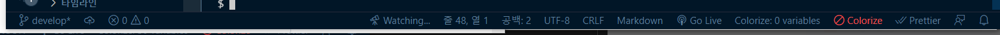

# frontend

## Project setup
```
npm install
```

### Compiles and hot-reloads for development
```
npm run serve
```

### sass연동
- VSCode `Sass`와 `live Sass` extension을 설치합니다.
- `.vscode`폴더에서 `settings.json`파일에서 아래의 코드를 복붙합니다.
```json
{
  "liveSassCompile.settings.formats": [
    {
      "format": "expanded",
      "extensionName": ".css",
      // 해당 sass파일의 한폴더 위의 css폴더   
      "savePath": "~/../css"
    }
  ],
  "liveSassCompile.settings.excludeList": [
    "**/node_modules/**",
    ".vscode/**"
  ],
  "liveSassCompile.settings.generateMap": true,
  "liveSassCompile.settings.autoprefix": [
    "> 1%",
    "last 2 versions"
  ],
  "[json]": {
    "editor.quickSuggestions": {
      "strings": true
    },
    "editor.suggest.insertMode": "replace"
  }
}
```

- VScode 하단의 `Watch Sass`를 눌러서 켜줍니다.




### Compiles and minifies for production

```
npm run build
```

### 

### Lints and fixes files

```
npm run lint
```

### Customize configuration
See [Configuration Reference](https://cli.vuejs.org/config/).
